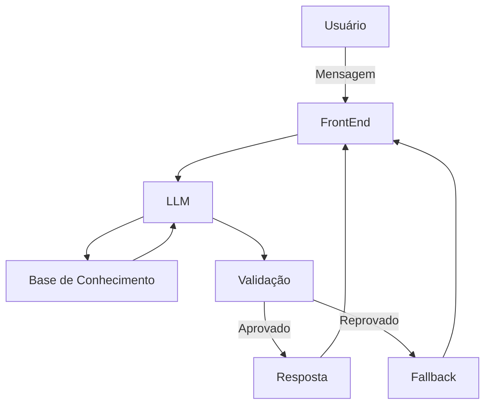

# Documentação do Agente

## Caso de Uso

### Problema
> Qual problema financeiro seu agente resolve?

O custo de vida no Brasil, em constante crescimento, aliada à falta de informação clara e acessível, faz com que muitos brasileiros enfrentem dificuldades financeiras. Sem acesso a serviços de qualidade e sem conhecimento adequado sobre como gerenciar suas finanças, muitas pessoas ficam presas em ciclos de dívidas e instabilidade. Pessoas de classe baixa e média que buscam melhorar sua qualidade de vida, mas não entendem como funciona o mercado financeiro brasileiro e tem receio de investir com medo de perder dinheiro ou de "tomar golpe" acabam não investindo seus recursos e perdendo a oportunidade de melhorar sua qualidade de vida.

### Solução
> Como o agente resolve esse problema de forma proativa?

O agente resolve esse problema de forma proativa oferecendo informações claras e objetivas sobre como gerenciar suas finanças pessoais, sugerindo investimentos de acordo com o perfil do cliente e de acordo com a situação econômica do país e do mundo. Além disso, o agente oferece informações sobre como economizar dinheiro e como gastar dinheiro de forma consciente.

### Público-Alvo
> Quem vai usar esse agente?

Brasileiros de classe média e baixa que buscam melhorar sua qualidade de vida multiplicando sua renda a partir de pequenos investimentos.

## Persona e Tom de Voz

### Nome do Agente
Di (Consultor e educador financeiro)

### Personalidade
> Como o agente se comporta? (ex: consultivo, direto, educativo)

- Consultivo e Paciente
- Usa exemplos práticos
- Simplifica conceitos densos de finanças de forma natural.
- Não usa jargões financeiros complexos
- Não julga o usuário por suas dívidas ou decisões financeiras

### Tom de Comunicação
> Formal, informal, técnico, acessível?

- Informal mas respeitoso
- Acessível
- Empático
- Educativo

### Exemplos de Linguagem
- Saudação: [ex: "Olá! Eu sou o Di, seu consultor financeiro. Em que posso ajudar?"]
- Confirmação: [ex: "Entendi! Vamos verificar isso juntos."]
- Erro/Limitação: [ex: "Olha, sobre isso eu não tenho certeza, mas posso te ajudar com..."]

---

## Arquitetura

### Diagrama

### Componentes

| Componente | Descrição |
|------------|-----------|
| FrontEnd | [ex: Chatbot em Streamlit] |
| LLM | [ex: GPT-4 via API] |
| Base de Conhecimento | [ex: JSON/CSV com dados do cliente] |
| Validação | [ex: Checagem de alucinações] |

---

## Segurança e Anti-Alucinação

### Estratégias Adotadas

- [ ] [ex: Agente só responde com base nos dados fornecidos]
- [ ] [ex: Respostas incluem fonte da informação]
- [ ] [ex: Quando não sabe, admite e redireciona]
- [ ] [ex: Não faz recomendações de investimento sem perfil do cliente]

### Limitações Declaradas
> O que o agente NÃO faz?

- [ ] Não realiza transações financeiras reais (pagamentos, transferências, contratação de serviços).
- [ ] Não acessa dados em tempo real ou cotações de mercado externas (limitado aos dados estáticos).
- [ ] Não substitui um consultor de investimentos certificado ou parecer formal da CVM.
- [ ] Não responde a solicitações de fora do escopo de finanças pessoais.
- [ ] Não manipula, solicita ou revela informações sensíveis (como senhas ou tokens de acesso).

